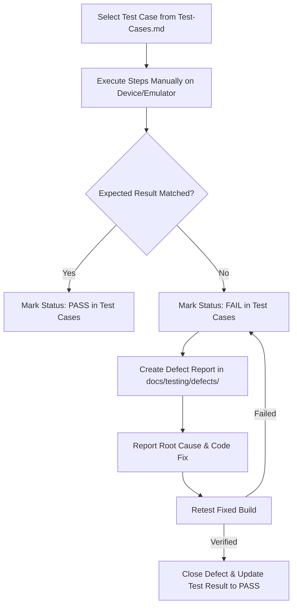

# Test Plan — MyTune Android Application

**Document Version**: 1.0  
**Status**: Baseline / Ready for Execution  
**Project**: MyTune Local Android Music Player  
**Target Release**: v1.0.0  

---

## 1. Objective

The objective of this Test Plan is to define the testing strategy, test environment, scope, test deliverables, and execution process for the **MyTune** Android application. This plan ensures that all implemented functional and non-functional requirements specified in the [SRS](file:///e:/AndroidApps/MyTune/docs/requirements/SRS.md) are rigorously tested and verified prior to release.

---

## 2. Scope

### 2.1 In-Scope (Features to be Tested)
* **Runtime Permissions**: Audio media read permission (`READ_MEDIA_AUDIO` / `READ_EXTERNAL_STORAGE`) and notification permission (`POST_NOTIFICATIONS`).
* **Media Scanning & File Filtering**: Scanning `MediaStore` and fallback storage scanning, extension validation, and call recording keyword exclusion.
* **Main UI & View Modes**: Track listing display, tab navigation ("All Songs" vs. "Playlists"), playlist detail view, header updates, and horizontal swipe gesture navigation.
* **Playlist Operations**: Creating playlists, adding tracks (batch & single), track reordering (Move Up / Down), track removal, and playlist deletion.
* **Playback Engine**: Play, Pause, Toggle Play/Pause, Next (wrap-around), Previous (wrap-around), Seek bar control, time label updates (`M:SS`).
* **Autoplay Functionality**: Autoplay ON mode (auto-advancing queue) vs. Autoplay OFF mode (pausing on track end).
* **Album Artwork Extraction**: Embedded artwork loading via `MediaMetadataRetriever` and fallback icon rendering.
* **Mini-Player Bar**: Mini-player visibility, thumbnail artwork, marquee title, Play/Pause control, Close (stop playback) button, and launch full player activity.
* **Foreground Service & Notification**: `MediaStyle` notification creation, status bar controls (Prev, Play/Pause, Next), background playback persistence, and `onTaskRemoved` cleanup.

### 2.2 Out-of-Scope (Features Not Being Tested)
* **Online Streaming / Cloud Music**: MyTune is an offline local player; remote APIs and cloud storage are out of scope.
* **Equalizer / Audio DSP Effects**: Audio equalizers and sound effects are not implemented in the application architecture.
* **Database Migration**: MyTune relies on `SharedPreferences` JSON serialization rather than SQLite/Room database schema migrations.

---

## 3. Testing Approach & Test Types

The testing strategy employs manual execution on Android physical devices and emulators, covering the following testing types:

| Test Type | Description & Scope |
| :--- | :--- |
| **Sanity / Smoke Testing** | Brief verification of core playback, permissions, and app startup to ensure build stability. |
| **Functional Testing** | Verification of all functional requirements (`FR-001` to `FR-024`) against expected software behavior. |
| **UI & Usability Testing** | Verification of layout rendering, dark theme compliance, marquee text animations, touch target response, and gesture navigation. |
| **Integration Testing** | Verification of inter-component interactions: `MainActivity` ↔ `MusicService` binding, `PlaySong` ↔ `MusicService`, `PlaylistManager` ↔ `SharedPreferences`. |
| **System & End-to-End Testing** | End-to-end user workflows: App Launch → Grant Permissions → Scan Media → Create Playlist → Play Track → Control via Notification → Swipe Away Task. |
| **Negative Testing** | Testing with invalid playlist names, missing audio files, denied permissions, corrupt audio files, and empty lists. |
| **Boundary Value & Equivalence Partitioning** | Testing single-track lists, empty playlists, first/last track next/previous boundary wrap-around, and 0:00 / end-of-track seek boundaries. |
| **Compatibility Testing** | Testing across Android API levels (API 24 Nougat up to API 37 Android 16) and different screen resolutions. |
| **Permission Testing** | Testing app behavior under granted, denied, or revoked permission states. |
| **Regression Testing** | Re-executing test suites after bug fixes to ensure existing functionality remains uncompromised. |

---

## 4. Test Environment & Prerequisites

### 4.1 Hardware / Device Configurations (To Be Confirmed during Execution)
* **Physical Android Device**: Android 13+ (API Level 33+) smartphone with local audio files.
* **Android Virtual Device (AVD)**: Android 7.0 (API Level 24) or higher emulator instance.

### 4.2 Test Data Requirements
* **Standard Audio Files**: Clean `.mp3`, `.m4a`, `.wav`, `.flac`, `.aac`, `.ogg` files without call recording keywords.
* **Call Recording Test Files**: Files containing keywords (`call_recording.mp3`, `voice_rec_001.m4a`, `soundrecorder_test.wav`).
* **Unsupported Files**: Non-audio files (`.txt`, `.jpg`, `.pdf`, `.mp4`) located in local music folders.
* **Embedded Artwork Files**: Audio files with embedded album covers vs. audio files without embedded tags.

---

## 5. Entry and Exit Criteria

### 5.1 Entry Criteria
* Source code compiles without errors (`./gradlew assembleDebug` exits with code 0).
* Target APK artifact (`app-debug.apk`) is built and installable.
* Requirements specification (`SRS.md`) and Test Scenarios are finalized.
* Test environment and test data files are prepared.

### 5.2 Exit Criteria
* 100% of defined test cases are executed.
* 0 Critical or High severity defects remain open.
* All discovered defects are logged, root causes analyzed, and verified fixed via retesting.
* Traceability matrix (`RTM.md`) reflects complete coverage of all functional requirements.

---

## 6. Test Execution & Defect Reporting Process

1. **Execution**: Tester executes test cases manually following steps in [`Test-Cases.md`](file:///e:/AndroidApps/MyTune/docs/testing/Test-Cases.md).
2. **Defect Discovery**: When actual result deviates from expected result, tester logs a defect using [`Defect-Report-Template.md`](file:///e:/AndroidApps/MyTune/docs/testing/Defect-Report-Template.md).
3. **Tracking**: Each defect receives a unique ID (e.g., `DEF-001`) and is placed in `docs/testing/defects/`.
4. **Retesting & Verification**: Fixed builds are re-tested to verify defect resolution and ensure no regression issues were introduced.

---

## 7. Risks and Assumptions

| Risk / Assumption | Impact | Mitigation Strategy |
| :--- | :--- | :--- |
| **Risk**: Storage permissions vary significantly between Android 12 (API 32) and Android 13+ (API 33). | High | Execute explicit permission test matrices on both API < 33 and API 33+ devices/emulators. |
| **Risk**: File system audio scanning behavior varies across custom Android manufacturer ROMs (Samsung, Xiaomi, Pixel). | Medium | Execute MediaStore scanning test scenarios alongside fallback direct directory scan tests. |
| **Assumption**: Media metadata extraction will execute reasonably fast for standard MP3/M4A files. | Low | Perform usability tests on track lists containing 50+ audio tracks. |

---

## 8. Deliverables

* [`docs/requirements/SRS.md`](file:///e:/AndroidApps/MyTune/docs/requirements/SRS.md) — Requirements Specification
* [`docs/testing/Test-Plan.md`](file:///e:/AndroidApps/MyTune/docs/testing/Test-Plan.md) — Master Test Plan (This Document)
* [`docs/testing/Test-Scenarios.md`](file:///e:/AndroidApps/MyTune/docs/testing/Test-Scenarios.md) — Test Scenarios Mapping
* [`docs/testing/Test-Cases.md`](file:///e:/AndroidApps/MyTune/docs/testing/Test-Cases.md) — Detailed Test Case Specifications
* [`docs/testing/RTM.md`](file:///e:/AndroidApps/MyTune/docs/testing/RTM.md) — Requirements Traceability Matrix
* [`docs/testing/Defect-Report-Template.md`](file:///e:/AndroidApps/MyTune/docs/testing/Defect-Report-Template.md) — Defect Log Template
* `docs/testing/defects/` — Individual Logged Defect Reports
* [`docs/testing/Test-Summary-Report.md`](file:///e:/AndroidApps/MyTune/docs/testing/Test-Summary-Report.md) — Final QA Execution Report
